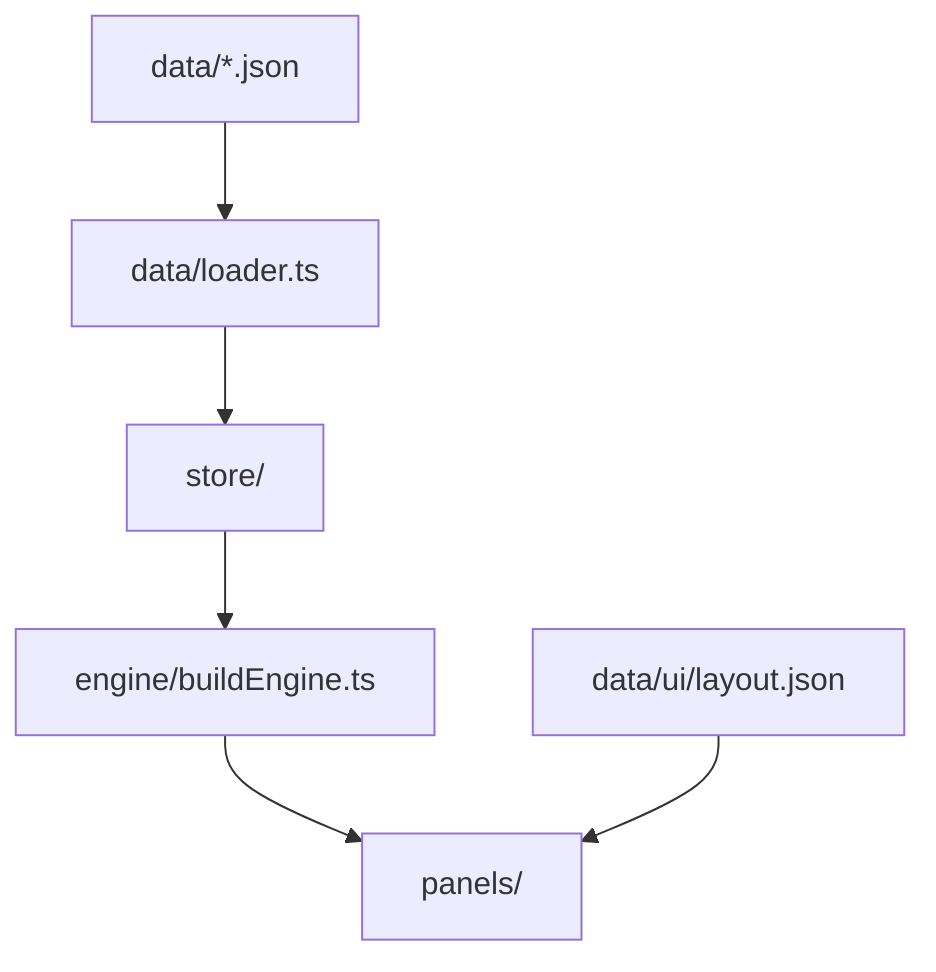

# Application source (`src/`)

React + TypeScript planner app. Game content lives in [`data/`](../data/) and is validated at load time — business logic reads from `GameData`, not hardcoded LoreRim numbers.

**Related docs:** [`data/README.md`](../data/README.md) · [`tools/import/README.md`](../tools/import/README.md) · [root `README.md`](../README.md)

---

## Layout

```
src/
  components/     # Reusable UI (perk trees, level bar, option details, …)
  data/           # Zod schemas, loader, validation
  engine/         # Build state, economy, codec, reconciliation
  layout/         # Layout-driven panel registry
  lib/            # Pure helpers (perk grid, training, effects, formatting)
  pages/          # Route-level views (landing, planner, builds)
  panels/         # Layout panels wired from data/ui/layout.json
  store/          # Zustand stores (build, UI, saved builds)
  test/           # Shared Vitest helpers
```

---

## Key modules

| Area | Entry points | Responsibility |
|------|--------------|----------------|
| Data loading | `data/loader.ts`, `data/schemas/index.ts` | Import JSON, validate, merge sidecars (`perk-player-level-reqs.json`, `race-effects.json`) |
| Build engine | `engine/buildEngine.ts` | Skill/perk/training budgets, perk selection rules, derived build computation |
| Build sharing | `engine/buildCodec.ts` | Encode/decode shareable build codes (v2 compact + legacy v1) |
| Perk UI math | `lib/perkTreeGrid.ts` | Grid bounds, stacks, prerequisite edges |
| Requirements | `lib/perkRequirements.ts` | Skill and player level gates for perk nodes |



---

## Progression systems

Skill levels, perk points, and skill points are **three separate systems**. See [`data/README.md`](../data/README.md) and [`.cursor/rules/giga-planner-data-model.mdc`](../.cursor/rules/giga-planner-data-model.mdc) before changing economy or perk fields.

---

## Testing

App unit tests use [Vitest](https://vitest.dev/) and live next to the code they cover (`*.test.ts`).

```bash
npm run test:app      # src/ only
npm run test:import   # tools/import/lib/ (Node test runner)
npm test              # both unit suites
npm run test:e2e      # Playwright functional tests (builds + preview server)
npm run test:watch    # Vitest watch mode
```

**Shared fixtures:** `src/test/helpers.ts` — `getTestAppData()`, `getTestGameData()`, `createTestBuildState()`.

**Functional / E2E:** Playwright specs live in [`e2e/`](../e2e/) and exercise the production build through real browser flows. CI runs them on every pull request ([`.github/workflows/functional-tests.yml`](../.github/workflows/functional-tests.yml)). Unit CI remains [`.github/workflows/test.yml`](../.github/workflows/test.yml) (`npm test`).

**Policy:** Every new feature, behavior change, or bug fix must include unit tests. See [`.cursor/rules/unit-testing-requirements.mdc`](../.cursor/rules/unit-testing-requirements.mdc) for coverage expectations, fixtures, and PR checklist. User-facing regressions should also be covered by an `e2e/` functional test when the change spans navigation, persistence, or import/export flows.

---

## Conventions

- **Engine logic** belongs in `engine/`; UI reads computed values from the store.
- **Player level requirements** for perks come from `data/game/perk-player-level-reqs.json` (populated by the LoreRim importer from `PERK` `GetLevel` conditions), merged at load as `perk.playerLevelReq` — do not parse `[Requires Level N]` from descriptions.
- **Theme and copy** come from `data/ui/`; avoid literal UI strings in components when a label key exists.
- **Panel registration** — new layout panels need a React component **and** an entry in `layout/panelRegistry.ts`.
